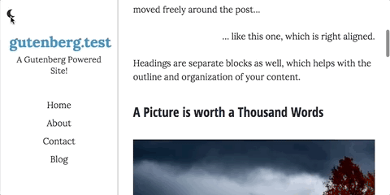
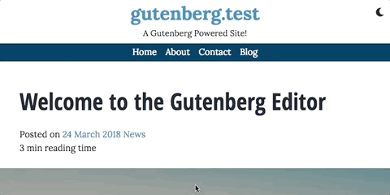

# Malik Theme - A Mobile-First, Gutenberg Ready Theme

## Howdy

Hello there! I'm a WordPress theme based on the _s starter theme and turned into a theme for bloggers. I'm responsive and mobile first, and I was born to be friendly to the Gutenberg editor!

I was named for [Om Malik](https://om.co/), a longtime user and friend of WordPress.

## Features

I have several features ready to go to make your site unique to you. Just by using the WordPress Customizer you have access to the following:

* Colors
    -  Background Color
    -  Text Color
    -  Accent Text Color _(things like captions, citations, post meta, and entry footers)_
    -  Accent Color _(things like thematic breaks, block separators, buttons, and navigation and quote borders)_
    - Header Menu & Footer Color _(for the background of those sections)_
    - Link Color _(also progression bar color)_
    - Link Active/Hover/Focus Color
* Theme Settings
    - Header Location - You can choose to keep my head on top, or put it to the side. It won't bother me!
    - Hide Header on Scroll - Make my header info disappear on scroll
    - Hide Header Menu on Scroll - Ditto for the header menu
    - Font Pairing - I have seven default font pairings so your content always looks good!
    - Night Mode - Let visitors toggle night mode to make the page darken for low-light reading
    - Read Time - Display an estimate for how long an article will take to read
    - Article Progression Bar - Show a progression bar for how far you've scrolled in an article
    - Author Info - Choose whether to display the author picture, display name, and description at the bottom of articles
    - Post Meta Header - Display info such as author URL, comments, tags, categories, post time, and post date via shortcodes before articles
    - Post Meta Footer - Display info such as author URL, comments, tags, categories, post time, and post date via shortcodes after articles

### Night Mode

### Sticky Menu

## In Progress

I am still trying to decide how I want to wear a sidebar when I'm displaying full width content. I'm working on a few ideas, but if you've got suggestions, let me know!

# welcome [https://bit.ly/coetlocalhackday]
